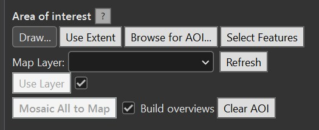
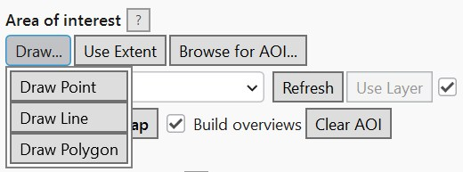
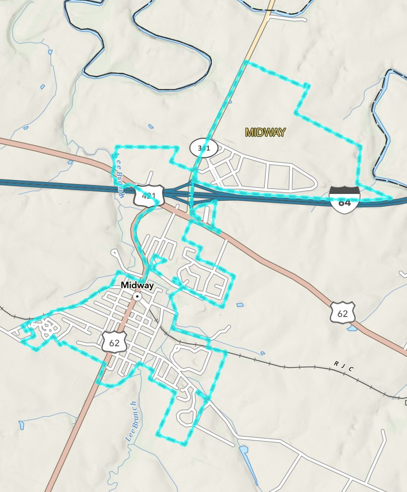

# Area of Interest

All AOI tools set the same search filter -- the STAC `intersects` geometry -- so only the last one
you use takes effect. The current AOI is summarized as text below the AOI buttons; **Clear AOI**
removes it.

## Draw

Click **Draw...** and choose **Draw Point**, **Draw Line**, or **Draw Polygon**. This activates an
ArcGIS Pro sketch tool on the active map -- draw your shape and it becomes the search AOI. Requires
an open map view.

## Use Extent

Sets the AOI to the active map view's current visible extent (reprojected to WGS84 automatically).
Requires an open map view.

## Browse for AOI...

Loads an AOI from a local `.shp` or `.geojson`/`.json` file. Unlike the other AOI tools, this
**works even without an open map view** -- useful before you've added any data to the project.
Multiple features in the file are unioned into a single AOI geometry.

## Select Features

Click **Select Features**, then click (or drag a box over) existing features on the active map.
Their combined geometry (unioned if more than one) becomes the search AOI, and the picked features
get the normal Pro selection highlight. Requires an open map view.

## Use Layer

Pick a layer from the **Map Layer** dropdown (click **Refresh** if a layer you just added isn't
listed), then click **Use Layer**.

- If the layer has features currently **selected** on the map, only those are used.
- If not, the whole layer's features are used (unioned into a single geometry).

The checkbox next to **Use Layer** (checked by default, tooltip "Use selected features") controls
this: uncheck it to always use the whole layer, even if some of its features happen to be selected.

## Mosaic All to Map

Not an AOI source itself, but lives in the same panel: builds one merged mosaic dataset from the
current raster (COG) results and adds it to the map. See [Mosaic & Footprints](mosaic-and-footprints.md).
