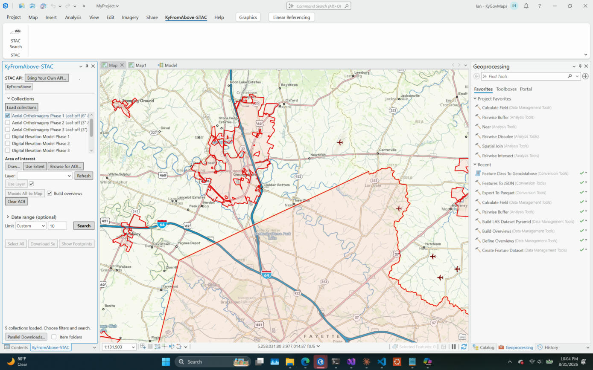
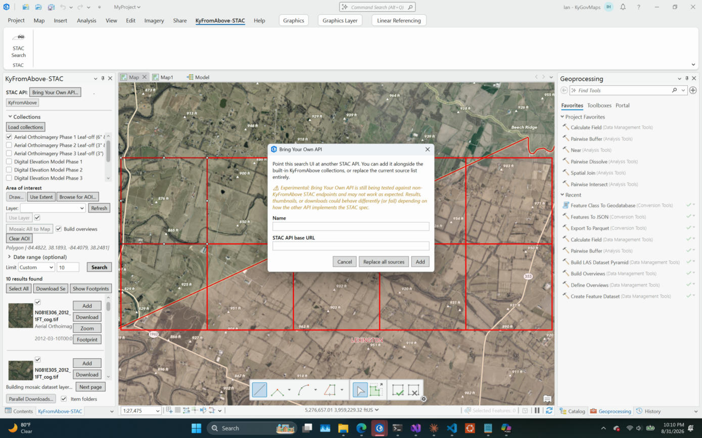

# Collections & Sources

## Loading collections

Under **Collections**, click **Load collections** to fetch the list of available collections from
every active API source and populate the checkbox list. Collection names are sorted alphabetically.

- **Nothing checked** &rarr; search runs against *every* collection from every active source.
- **Some checked** &rarr; search is limited to just those collections.

## Bring Your Own API

!!! warning "Experimental"
    Bring Your Own API is still being tested against non-KyFromAbove STAC endpoints and may not
    work as expected. Depending on how the other API implements the STAC spec, results,
    thumbnails, or downloads could behave differently or fail outright.

The built-in **KyFromAbove** catalog is always available, but you can point the pane at any other
STAC API (for example, a self-hosted [stac-fastapi](https://github.com/stac-utils/stac-fastapi) or
[TiTiler](https://developmentseed.org/titiler/)-backed catalog) that implements the standard
`/collections` and `/search` endpoints.

1. Click **Bring Your Own API...** at the top of the pane.
2. Enter a **Name** (used to label collections from that source) and the **STAC API base URL**.
3. Choose:
    - **Add** &mdash; keep the current source(s) and add this one alongside them.
    - **Replace all sources** &mdash; drop every current source and search only this API.

Active sources are shown as small chips under the button. Any source you added (not the built-in
default) has a small **x** to remove it, which also clears any collections/results that came from
it.

When more than one source is active, collections from non-default sources are labeled
`Title · Source Name` in the checklist so they're never ambiguous.

## How multi-source search works

- **Load collections** queries every active source independently -- one unreachable "bring your
  own" API doesn't stop the built-in catalog (or any other source) from loading.
- **Search** runs in parallel across whichever sources have a matching checked collection (or every
  source, if nothing is checked), then merges the results into one list.
- **Pagination** ("Next page") is tracked per source, so a source that runs out of results doesn't
  block paging through the others.
