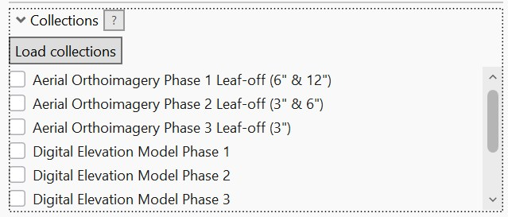
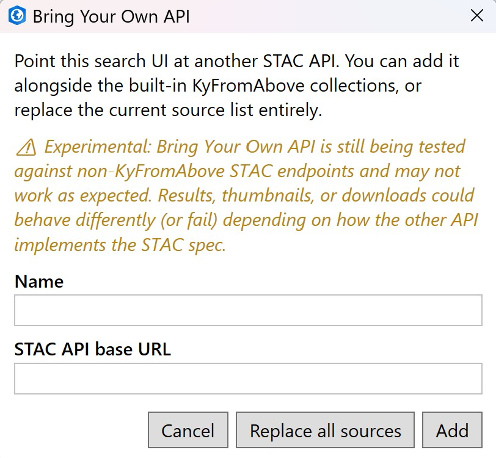

# Collections & Sources

## Loading collections

Under **Collections**, click **Load collections** to fetch the list of available collections from
every active API source and populate the checkbox list. Collection names are sorted alphabetically.

- **Nothing checked** &rarr; search runs against *every* collection from every active source.
- **Some checked** &rarr; search is limited to just those collections.

## Bring Your Own API

!!! warning "Experimental"
    Bring Your Own API is still being tested against non-KyFromAbove STAC endpoints and may not
    work as expected. Depending on how the other API implements the STAC spec, results,
    thumbnails, or downloads could behave differently or fail outright.

The built-in **KyFromAbove** catalog is always available, but you can point the pane at any other
STAC API (for example, a self-hosted [stac-fastapi](https://github.com/stac-utils/stac-fastapi) or
[TiTiler](https://developmentseed.org/titiler/)-backed catalog) that implements the standard
`/collections` and `/search` endpoints.

1. Click **Bring Your Own API...** at the top of the pane.
2. Either pick a catalog from the **Choose a public API from STAC Index** dropdown, which fills in
   the Name and URL for you, or type your own: a **Name** (used to label collections from that
   source) and the **STAC API base URL**. You can edit the filled-in values before continuing.
3. Choose:
    - **Add** &mdash; keep the current source(s) and add this one alongside them.
    - **Replace all sources** &mdash; drop every current source and search only this API.

The dropdown is loaded live from [STAC Index](https://stacindex.org/) when the dialog opens. It
lists only public catalogs that expose a searchable STAC API: catalogs that need a login or API key,
static (non-searchable) catalogs, and openEO endpoints are left out. If STAC Index can't be
reached, you can still enter a URL by hand.

### Getting back to the KyFromAbove catalog

**KyFromAbove (Kentucky's default catalog)** is always the first entry in the dropdown, even when
STAC Index can't be reached. After switching to another API, open **Bring Your Own API...**, pick
it, and click **Replace all sources** to restore the built-in source. Clicking **Add** with it
selected adds it back alongside your other sources instead (or tells you it's already active).

Active sources are shown as small chips under the button. Any source you added (not the built-in
default) has a small **x** to remove it, which also clears any collections/results that came from
it.

When more than one source is active, collections from non-default sources are labeled
`Title · Source Name` in the checklist so they're never ambiguous.

## How multi-source search works

- **Load collections** queries every active source independently -- one unreachable "bring your
  own" API doesn't stop the built-in catalog (or any other source) from loading.
- **Search** runs in parallel across whichever sources have a matching checked collection (or every
  source, if nothing is checked), then merges the results into one list.
- **Pagination** ("Next page") is tracked per source, so a source that runs out of results doesn't
  block paging through the others.
