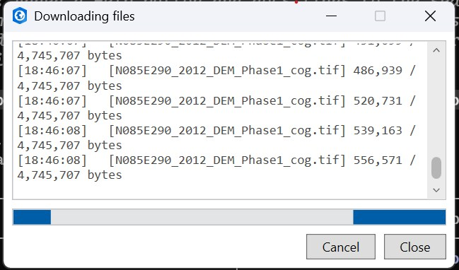
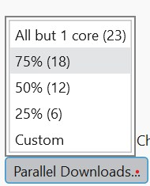
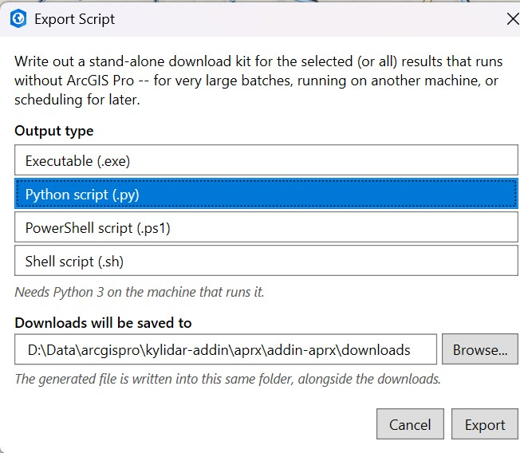

# Downloads

## Downloading selected results

Click **Download Selected** (above the results list). If nothing is selected, every downloadable
result is used instead. You'll be prompted to **pick a destination folder** -- there's no
persistent "download to" box, so this happens fresh each time; the dialog starts in whatever folder
you picked last.

A progress dialog shows per-asset status as downloads run, with a **Cancel** button that stops any
downloads still in progress (already-completed files are kept).

Both raster (COG) and point-cloud (`.laz`/`.las`, etc.) assets can be downloaded this way, even
though point-clouds can't be added directly to the map.

## Parallel Downloads

The **Parallel Downloads ▾** button (bottom of the pane) controls how many assets download at once:

| Option | Meaning |
|---|---|
| All but 1 core | `core count - 1` parallel downloads |
| 75% *(default)* | 75% of available cores |
| 50% | 50% of available cores |
| 25% | 25% of available cores |
| Custom | Enter any number in the box that appears |

## Download each item to its own folder

The **Item folders** checkbox next to **Parallel Downloads** controls folder layout:

- **Unchecked** *(default)* -- all files download flat into the chosen folder. Filenames are
  prefixed with the item ID to avoid collisions.
- **Checked** -- each item gets its own subfolder, named after the item ID.

## Downloading a single item

Each result row also has its own **Download** button, which prompts for a save location (a single
file, via a standard Save dialog) instead of using the shared destination-folder flow above.

## Export Script

**Export Script...** (next to Download Selected) writes out a stand-alone download kit for the
selected (or all) results that runs without ArcGIS Pro -- useful for very large batches, running on
another machine, or scheduling for later.

Choose an **output type** -- a Python script (`.py`, needs Python 3, selected by default), a
Jupyter notebook (`.ipynb`, runs in Jupyter/JupyterLab, VS Code's notebook viewer, or Google
Colab), a self-contained executable (`.exe`, no dependencies), a PowerShell script (`.ps1`), or a
shell script (`.sh`) -- and where the downloads (and the generated file itself) should be saved,
then click **Export**.

