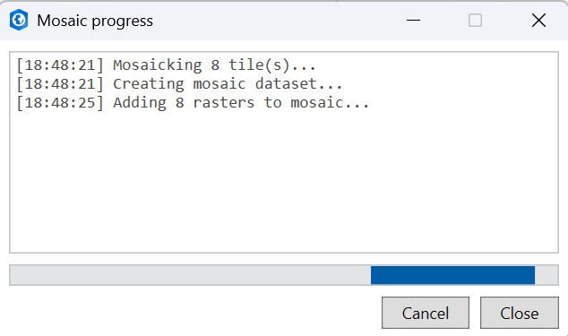
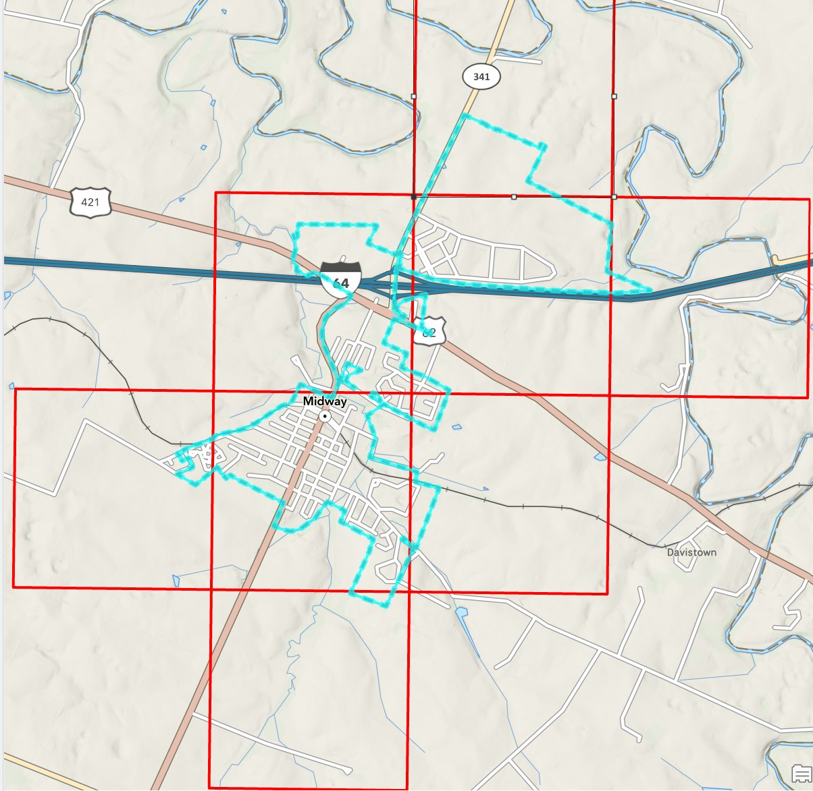

# Mosaic & Footprints

## Mosaic All to Map

Builds **one** mosaic dataset layer from the current raster (COG) results and adds it to the active
map -- useful for viewing many tiles as a single seamless layer instead of adding them one at a
time.

- Uses the **selected** results if any are checked; otherwise uses every raster result in the list.
  Point-cloud assets are skipped automatically.
- **Build overviews** *(checked by default)* defines and builds raster overviews after the mosaic
  is created, for faster display at small map scales. Unchecking it skips that step (faster to
  create, slower to redraw when zoomed out).
- Requires an open map view (the mosaic is created in the project's default geodatabase, using the
  map's spatial reference).
- A progress dialog reports each step (create dataset, add rasters, define/build overviews) and
  has a **Cancel** button. Cancelling takes effect before the *next* step starts -- it can't
  interrupt a geoprocessing step that's already running.

!!! note "Large batches (100+ tiles)"
    Above 100 mosaic-eligible tiles, **Mosaic All to Map** is disabled outright -- narrow your search
    or select fewer tiles first. Below that, **Build overviews** defaults to unchecked once you're
    over 100 tiles (building overviews over that many COGs can take a long time), unless you've
    already set it yourself, in which case your choice sticks.

## Show Footprints

Draws the footprint of every current result as an outline on a **KyFromAbove Footprints** graphics
layer, then zooms to their combined extent. Re-running it replaces the previous footprints rather
than stacking duplicates. Requires an open map view.

Each result row also has its own **Footprint** button to draw just that one item's footprint (and
zoom to it) without affecting the others.

