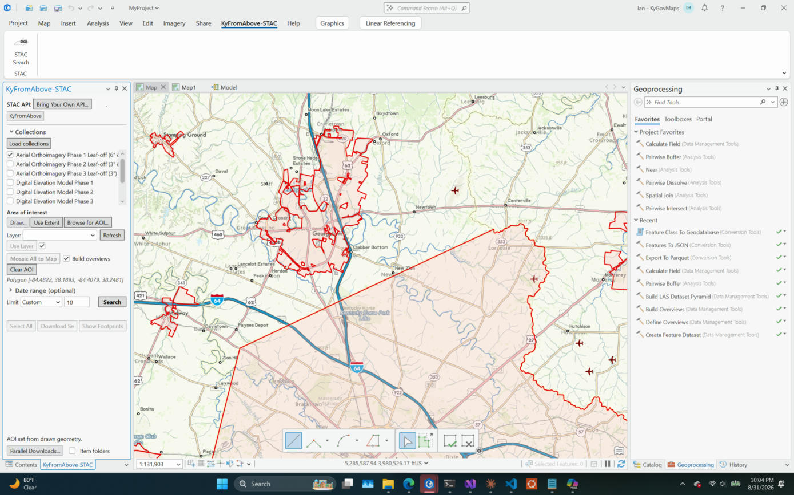
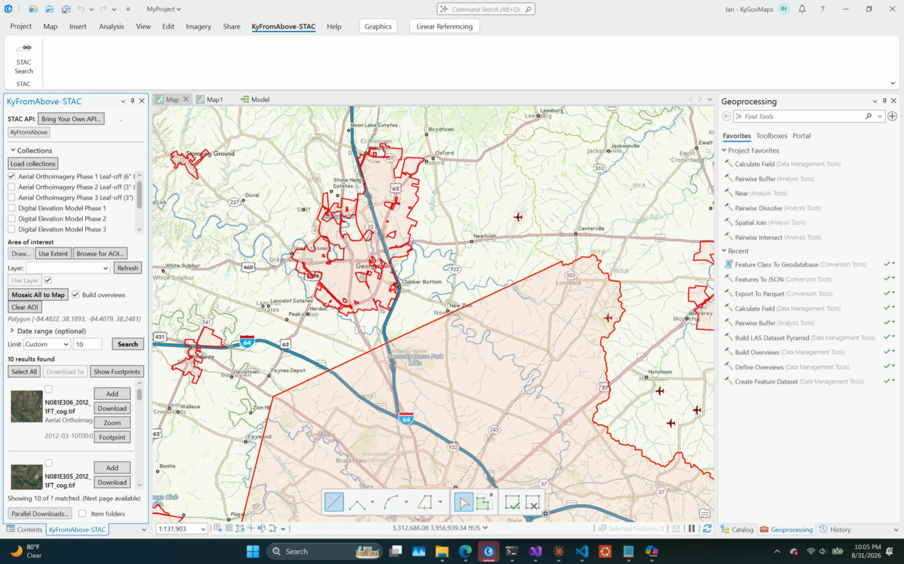
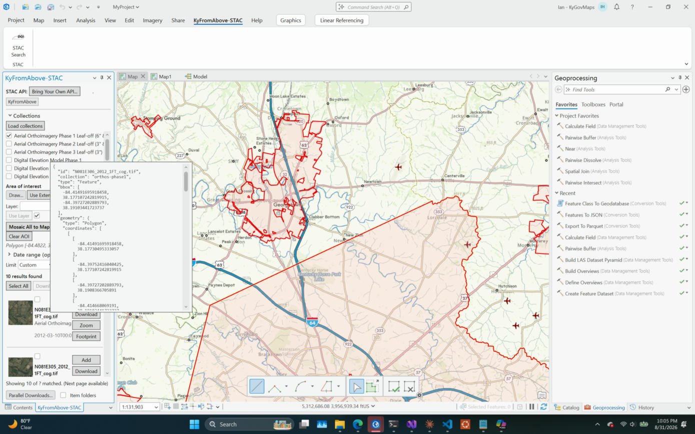

# Search & Results

## Filters

| Control | Notes |
|---|---|
| **Collections** | See [Collections & Sources](collections-and-sources.md). |
| **Area of interest** | See [Area of Interest](area-of-interest.md). |
| **Date range (optional)** | Collapsed by default; expand to filter by start/end date. |
| **Limit** | 50 / 100 / 200 / 500 preset dropdown, or **Custom** for any value. Defaults to 10. |

!!! note "Thumbnails and large limits"
    When **Limit** is above 50, thumbnail loading is automatically disabled for that search to avoid
    a burst of extra network requests -- a note appears under the Search button when this is active.

## Reading the results

- The summary line above the results (e.g. *"Showing 50 of 812 matched"*) shows how many results
  loaded versus how many total matches the search found.
- **Select All** toggles selection on every visible result (used for bulk download).
- **Download Selected** downloads the selected assets -- see [Downloads](downloads.md).
- **Show Footprints** draws every current result's footprint on the map.
- If any point-cloud (`.laz`/`.las`) results are present, a tip explains that they can be
  downloaded but not added directly to the map.
- **Next page**, next to the status message at the bottom, appears when more results are available.

## Each result row

- **Thumbnail** (when enabled) -- loaded automatically per item.
- **Checkbox** -- selects the item for bulk actions.
- **Title, collection, date, status** -- status shows download progress or errors for that item.
- **Hover tooltip** -- shows the full underlying STAC item as pretty-printed JSON (id, properties,
  assets, links, geometry). Handy for checking exact metadata without leaving the pane.
- **Per-item buttons:**
    - **Add** -- adds the item's raster (COG) asset directly to the active map.
    - **Download** -- prompts for a save location and downloads that one asset.
    - **Zoom** -- zooms the map to the item's bounding box.
    - **Footprint** -- draws just this item's footprint on the map.

